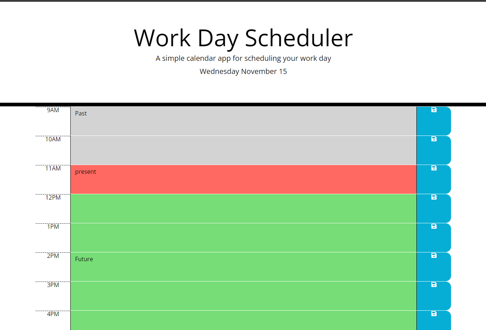
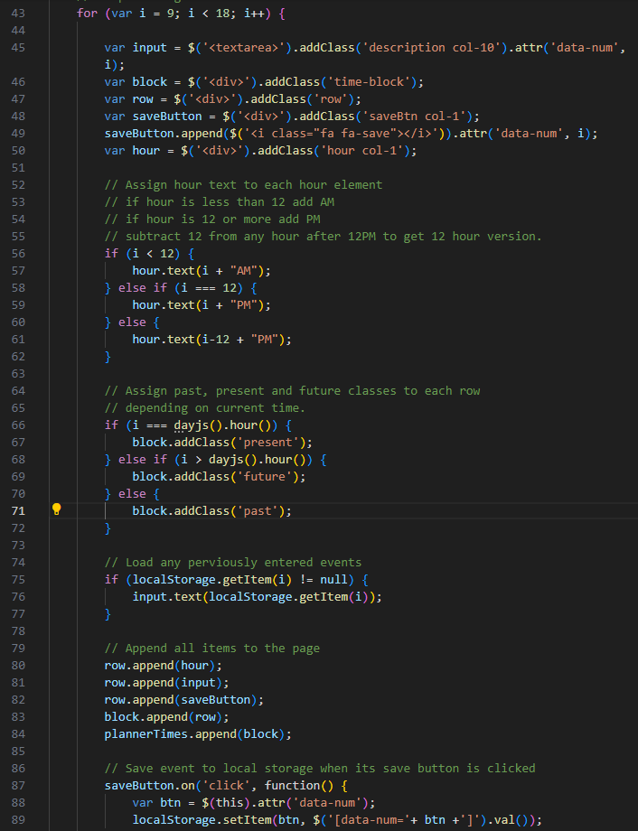

# Daily Planner Bootcamp Challenge 7th assignment

## Description

A daily planner built using the Days.js API.

This application used the Day.js API to retrieve information about the current date and time. 

This task taught me how to ustilize third-party APIs in my projects and how to effectively use local storage.

## Installation

Either open the pages or download the repo

## Usage

Use the buttons to input and save data to local storage